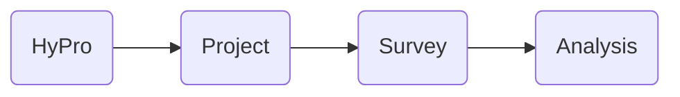
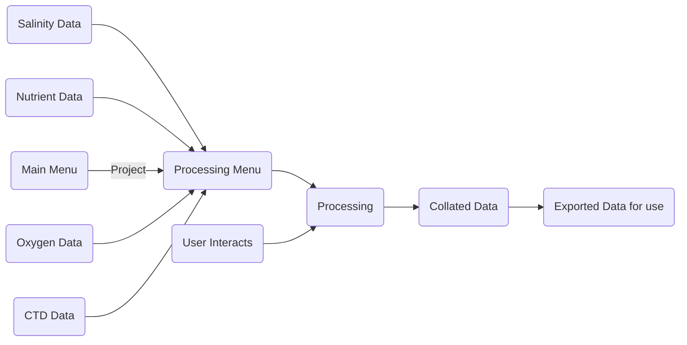



# HyPro Technical Documentation

> ##### Ctrl+F is your friend :grin: 

## Table of Contents
#### [1. Introduction and Background](#introduction-and-background-1)
#### [2. Hydrology Processing](#hydrology-processing-1)
#### [3. HyPro in Python](#hypro-in-python-documentation)
#### [4. Documentation on each file](#documentation-of-each-file) 
#### [5. Flagging System](#flagging-system-1)
#### [6. Glossary](#glossary-1)

## Introduction and Background

HyPro was developed as a tool for collating and processing hydrology data including dissolved inorganic nutrients, dissolved oxygen and salinity. The software can ingest data files from each analysis and process the data as required. Voyage CTD deployment data can then be automatically matched up, allowing the creation of a final product that includes all the data grouped by each CTD deployment.

### HyPro Processing Structure
HyPro is structured in a way to allow voyage data to be compartmentalized and organised neatly. The structure has a set hierachry that allows an individual sample to be identified and stored in the sqlite database with necessary defining features.

A project is setup for each voyage, this keeps data separated for each, creating a unique portable sqlite database file. 

A survey is a subsidery of the project and allows for the grouping of specific samples, e.g. CTD and underway samples. If a new project is created with the type CTD, a default survey is automatically created. 

An analysis is the process of measurement for each analyte, within HyPro these can be activated or deactivated for each survey, depending on the needs of the user.

### Hydrochemistry analytes
#### Nutrients
Seawater nutrients are measured with a colormetric chemical method, whereby sample water is injected and mixed with various chemical reagents to produce a particular color, which is highly absorbant at one specific wavelength. The absorbance of each sample is measured, calibration standards of known concentrations are used to create a calibration curve. The concentrations of measured sample are determined against the calibration curve.

For quality control an international reference standard is measured with each analysis, this allows the exact accuracy of the analysis to be determined. A number of other quality control measures are put in place to ensure the data quality is of international oceanographic standard.

#### Dissolved Oxygen
Dissolved oxygen measurements are made to calibrate the lowered sensors on the CTD rosette package. Oxygen measurements are made using an automated titration. This method is highly accurate and precise, often the largest contributor to bad oxygen mesaurements is incorrect sample collection. 

#### Salinity 
Salinity measurements are also made to calibrate the CTD rosette sensors. The determination of salinity is made through a physical measurement of the conductivity of the seawater. This measurement is much more accurate and precise than that of the typical CTD sensor. For the measurement of each deployments worth of samples the instrument is calibrated to within 0.001 PSU.

## Hydrology Processing

### Nutrients
The algorithms used in processing nutrient data is quite complex and the interfaces provided by HyPro allow for a fast and automated process for high quality nutrient data.

Nutrients are measured by a continuous flow nutrient analyser, Seal Analytical AA3. This instrument measures concentrations of nutrients in seawater colormetrically and calibrates the peak height signal to produce calculated concentrations. The AA3 on RV Investigator contains 5 channels, with the ability to measure 5 different nutrients in parallel.

  

The Seal software produces two files when data is exported, these are a .SLK (.SYLK file format) and .CHD (Semi-colon separated file). The .SLK contains the run analysis information, such as various parameters and the tray protocol of the analysis. The .CHD file contains the signal information for each channel, each column is a different channel and each row is analog to digital signal conversion value for each second.

In an ideal world these peaks are <b>П </b> shaped, as this represents a perfectly separated and formed sample. More typically peaks are slightly rounded, as seen in the image above. Ideally as well, across a run peaks will stay consistently spaced, this is not always the case especially when analyses are long (>3 hours).

### Steps of processing nutrient data

>There are several steps required in the processing of nutrient data, mainly due to the nature of the signal and chemistry that is used.

<b>Overview:</b>
 1. Match raw A/D data to analysis cup list
 2. View trace and determine if peak shapes are acceptable
 3. Take median of each peak plateau window
 4. Apply baseline corrections
 5. Apply carryover corrections
 6. Apply drift corrections
 7. Iteratively apply regression to ensure calibrants are within defined error margins
 8. Calculate concentrations
 9. Look at QC charts to determine if analysis was within acceptable limits (acceptable limits set by Hydrochemistry)

#### 1. Match raw A/D data to analysis cup list
In order for the analog to digital data to make sense, it needs to be aligned with the sample analysis order, which is held within the .SLK file. Matching up the CHD raw data to the SLK sample order then allows processing to take place

  

#### 1.5 Apply time correction to realign peaks 
This is not entirely necessary and not implemented in the current version. However  on longer analytical runs with continuous segmented flow, the peaks can begin to shift, meaning the peak windows will not be consistently spaced. 
To combat this, I have implemented a manual peak shifting for fixing the issue.

  

To counter this the half height of a drift sample can be measured and see if half of its height is in the expected place. If half of the peak height is not in the expected place, within reason, the peak start values will then be shifted to account for the difference.

#### 2. View trace and determine if peak shapes are acceptable
This is both an automatic and user involved process. When first loading up the dataset the user will want to inspect the analysis trace to ensure peak shapes are in specification and the peak window is fitting correctly. Here an interactive chart will be required so the user can pan around, zoom in and assess the shape or window fit.

#### 3. Take medians of each peak plateau window
After checking that the peak windows are in the correct spot, the median peak height for each peak can be calculated. This value will be used for the processing from here on, meaning each peak on has one signal value now associated with it.

#### 4. Apply baseline corrections
The first step in altering the data to determine concentrations is performing a baseline sample correction across all samples in an analytical run. The baseline correction that is preferred to be used is a <b>piece-wise</b> correction, meaning between each baseline sample a linear interpolation is calculated between the two points. 

#### 5. Apply carryover correction
Carryover correction is used to account for the small amount of sample that may potentially pass between each sample. This can be most noticeable if for example an extremely high concentration sample was measured and then a near detection limit sample was then measured. To account for this a series of samples are used to quantify the carryover, referred to as high and lows. These are analysed in the following order to determine a carryover correction factor applied to all the peaks.

  

The peak height values from this series of peaks is used in the following equation to calculate a coefficient (<i>k</i>) and that is then used to correct peaks.

$$
k =(B - C) / (A - B)
$$

$$
\dot{x}  = (n) peak - k \cdot(n-1)peak
$$

#### 6. Apply drift corrections
Similarly to the baseline correction, the drift correction is applied in a <b>piecewise</b> manner. However to limit the amount of correction that can take place between two drift samples, the interpolation is calculated from a ratio to the mean of all drifts.
Consider an array of drifts [drift1, drift2, drift3, drift4], first the mean peak height is calculated.
$$
\bar{x} = \dfrac{\sum{x_{1}, x_{2}, {x_3}, {x_4}}}{n-1} 
$$
Using this calculated mean drift height, each drift throughout the run is compared and a simple ratio of the n^th^ drift to the mean drift. 

A drift to drift linear interpolation is then calculated using the ratio of change values and the time through the analysis, in seconds. The interpolation would then look like something below.

  

#### 7. Iteratively apply regression
To minimise the error in fitting a calibration curve, an iterative approach is taken to ensure the calibrants incorporated are the concentration they're expected to be. 
If the calibrant error to the fit is greater than the first cutoff, it is marked as suspect and the weighting is cut in half. If the error is greater than the second cutoff, it is marked as bad and removed entirely from the fit. 
The cutoff limits are defined as the method detection limit or 0.5% of full scale (derived from WOCE), whichever is greater.

#### 8. Calculate concentrations
The concentrations of each sample are simply determined by solving the calibration curve using the median peak heights. 

At this stage, any diluted samples should be considered and re-corrected to their original concentrations. This is calculated by taking into account the amount of nutrients that is found in the LNSW, which is used when diluting over-range samples. Original concentrations are calculated as follows, where <i>dil</i> is the dilution factor which is a number greater than 1, e.g. 1:10 dilution = 10.

$$
\dot{x} = x \cdot dil - (dil - 1) \cdot [LNSW]
$$

#### 9. QC Charts
To assess a run, a number of quality control charts are inspected to ensure the analysis meets standards. The quality control parameters that are investigated are:
 
- Calibration curve fitting and linearity
- Calibrant error
- Baseline consistency 
- Drift consistency
- Method detection limit precision
- RMNS accuracy and precision
- Any other quality control samples, i.e. BQC, Internal QC.

### Dissolved Oxygen
HyPro does not do anything special for processing of the oxygen data, parsing the output file a .LST (Space separated text file) is a little messy. The most processing required is the multiplication of the value from the instrument to change it from mL/L of oxygen in water to micromole/L of oxygen in water. This is accomplished by multiplying by 44.66.

### Salinity 
No further processing is required for the salinity data after it has been acquired by the software. The data is read in and matched with the CTD deployments if required. File format is a simple .XLS (Excel sheet file)

### CTD Sampling Logsheet
These logsheets are read in for CTD deployments so that the bottles can be matched to the relevant rosette positions on the CTD. This is more used for the salinity and dissolved oxygen, however could be better implemented for nutrients

### CTD Seasave Data
This data is ingested to be used for the quality control and checking of sample analysis. The data from this is used to check for differences between the sensor and bottle data. The .ROS file is used as it provides the CTD around where the bottles were fired and should provide the best value for comparing to the bottle results.

# HyPro in Python documentation

### Structure 
HyPro in python was very heavily based off of the processing and workflow of the first HyPro, written in Matlab. This workflow allows data to be contained on a voyage basis and also allows for a systematic approach in processing files.
The structure of how HyPro runs is outlined:

---
## Python file structure
( this is out of date and I should autogenerate a new one)
 - assets
 - [dialogs](#dialogs)
	 -  [AddRMNSDialog.py](#addrmnsdialog)
	 - [AnalysisDialog.py](#analysisdialog)
	 - [CreateNewProject.py](#createnewproject)
	 - [DeleteDialog.py](#deletedialog)
	 - [DialogTemplate.py](#dialogtemplate)
	 - [ExportDeployments.py](#exportdeployments)
	 - [ImportProject.py](#importproject)
	 - [OpenProject.py](#openproject)
	 - [ParametersDialog.py](#parametersdialog)
	 - [PlotSelectionDialog.py](#plotselectiondialog)
	 - [ProducePlotsDialog.py](#produceplotsdialog)
	 - [RereadDialog.py](#rereaddialog)
	 - [RMNSDialog.py](#rmnsdialog)
	 - [SurveyDialog.py](#surveydialog)
	 - [TraceSelectionDialog.py](#traceselectiondialog)
	 - [ValveControl.py](#valvecontrol)
	 - [ViewData.py](#viewdata)
	 - [ViewDataDialog.py](#viewdatadialog)
 - [processing](#processing)
	 - [ProcessingMenu.py](#processing-menu)
	 - [LoggerOutput.py](#logger)
	 - [RefreshFunction.py](#refreshfunction)
	 - [QCStats.py](#qcstats)
	 - [algo](#algo)
		 - [HyProComplexities.py](#hyprocomplexities)
		 - [Structures.py](#structures)
	 - [plotting](#plotting)
		 - [PlottingWindow.py](#plottingwindow)
		 - [QCPlots.py](#qcplots)
	 - [procdata](#procdata)
		 - [InteractiveNutrientsProcessing.py](#interactivenutrientsprocessing)
		 - [InteractiveOxygenProcessing.py](#interactiveoxygenprocessing)
		 - [InteractiveSalinityProcessing.py](#interactivesalinityprocessing)
		 - [ProcessSealNutrients.py](#processsealnutrients)
		 - [ProcessScrippsOxygen.py](#processscrippsoxygen)
		 - [ProcessGuildlineSalinity.py](#processguildlinesalinity)
	 - [readdata](#readdata)
		 - [ReadSealNutrients.py](#readsealnutrients)
		 - [ReadScrippsOxygen.py](#readscrippsoxygen)
		 - [ReadGuildlineSalinity.py](#readguildlinesalinity)
		 - [InitialiseCTDData.py](#initialisectddata)
		 - [InitialiseSampleSheet.py](#initialisesamplesheet)
		 - [InitialiseTables.py](#initialisetables)
 - [tests](#tests)
	 - [tests.py](#tests-file)

# Documentation of each file

## Dialogs

#### AddRMNSDialog 

Creates the window for adding a new RMNS into the local computer database of RMNS values.

##### <i>class</i> addrmnsDialog (database)
><b>Parameters</b>: 
 - database : string (path to database)
---

#### AnalysisDialog
Creates the dialog for adding/activating analyses within a project. Can be useful for temporarily switching 'off' a an analysis when trying to process or edit something

---

#### CreateNewProject
Creates the dialog for producing a new project

---
#### DeleteDialog
The dialog for deleting already processed data from the project. Includes the option for 

#### DialogTemplate
This class extends the base QDialog to setup some boilerplate on how we want the dialog windows to look. It primarily sets the icon, stylesheet, window location (center of active screen), sets the title and creates an underlying grid layout. 

##### <i>class</i> hyproDialogTemplate (width, height, title)
Creates a standard template that we're happy with to build off of.
><b>Parameters</b>: 
 - height: int
 - width : int
 - title : string

---
#### ExportDeployments
Provides the dialog for exporting data to csv or nc formats for publishing

---
#### ImportProject
Produces the dialog that allows a project to be import, for example the project was created and used on the ship. The project was copied and taken back to shore. It can then be imported and processing can continue

---
#### OpenProject
Open an existing project that is loaded in the local computer memory

---
#### ParametersDialog
This is a complex dialog that allows for the editing and customisation of many parameters. Without this feature software updates to acquisition software could very easily break the importing of file formats.

---
#### PlotSelectionDialog
Not implemented yet - should allow selection of data points from any plot

---
#### ProducePlotsDialog
Not implemented fully - allows for the creation of custom plots as selected by the used 

---
#### RereadDialog
Creates a dialog that lets the user reselect a file for reprocessing

---
#### RMNSDialog
Displays the RMNS that are currently in memory

---

#### SurveyDialog
Creates a dialog that allows the configurable parameters for each survey to be set, this is a flexible dialog that changes based on the activated analyses

---
#### TraceSelectionDialog
Creates a dialog when a user clicks on the trace from a nutrient run when processing. This provides all the information about the point they clicked.

---

#### ValveControl
Not fully implemented - used for controlling a VICI automated valve
May remove

---

#### ViewData
Creates a dialog to show the data that the user has selected

---

#### ViewDataDialog
Allows the user to select data and view 

---

## Processing

#### Processing Menu
The second main menu window, the processing menu functions as the hub for when a project is loaded and opened. From this screen it allows the user to read, delete and view data. It allows for the creation of plots via the menus. 

---

#### LoggerOutput
A modified QPlainText that extends the logging Handler, essentially merging the two and allowing a scrollable text window to catch all the log message and display them as necessary. This is used to inform the user of processed data or if an error has occured.

---

#### RefreshFunction
Creates the functionality of loading in the newest file when a refresh is initiated. It follows a particular pattern of ingesting data files such that the order is CTD, Sample Logsheet, Salinity, Oxygen then Nutrients. This is to allow the proper datasets to be in place before other datatypes are read in. The obvious example of this is having CTD data in before Salinity and Oxygen so that an error plot can be produced.

---

#### QCStats

---

### Algo

#### HyproComplexities

---

#### Structures

### Plotting

#### PlottingWindow

---

#### QCPlots

---

### Procdata

#### InteractiveNutrientsProcessing

---

#### InteractiveOxygenProcessing

---

#### InteractiveSalinityProcessing

---

#### ProcessSealNutrients

##### matchup_peaks (slk_data, chd_data, proc_parameters, current_nutrient, working_data)
Finds the window values that correspond to each peak as listed in the SLK file, using the peak start value.
><b>Parameters</b>: 
 - slk_data : SLKData
 - chd_data : CHDData
 - processing_parameters : dict
 - current_nutrient : string
 - working_data : WorkingData
><b>Returns</b>: 
 - working_data : WorkingData

##### peak_shape_qc (window_values, quality_flags)
Calculates whether or not a peak shape is within acceptable limits, if not it will give it an appropriate flag.
><b>Parameters</b>: 
 - window_values : array-like
 - quality_flags : array-like
><b>Returns</b>: 
- quality_flags : array

##### window_medians (window_values)
Calculates the medians for each array row
><b>Parameters</b>: 
 - window_values : array 
	 - array shape n peaks length, n window points width e.g. (50, 14) (peaks, no. points)
><b>Returns</b>: 
- window_medians : array

##### find_cup_indexes(specified_cup, analysis_cups)
Finds the indexes of a specified cup from the cups in a run
><b>Parameters</b>: 
- specified_cup : string
- analysis_cups : array-like 
	 - array of strings that represent the cups in an analysis run
><b>Returns</b>: 
- clean_indexes : array of ints

##### find_carryover_indexes(high_cup_name, low_cup_name, analysis_cups)
Finds the indexes of the cups relating to carryover
><b>Parameters</b>: 
 - high_cup_name : string
 - low_cup_name : string
 - analysis_cups : array-like
	 - array of strings that represent the cups in a run
><b>Returns</b>: 
- clean_high : int
- clean_low : array of ints

##### carryover_correction (high_index, low_indexes, window_medians)
Calculates and applies the carryover correction to an array of peak medians
><b>Parameters</b>: 
 - high_index : int
 - low_indexes : array-like  
 - window_medians : array_like
><b>Returns</b>: 
- new_window_medians : list
-  carryover_correction : float

##### organise_basedrift_medians (relevant_indexes, window_medians)
Due to how the baseline and drift corrections are applied, this function prepares the values for this, duplicating starting and ending values if the drift or baselines are not already there
><b>Parameters</b>: 
 - relevant_indexes : array-like
 -	window_medians : array_like
><b>Returns</b>: 
- medians : list
- relevant_indexes : list

##### baseline_correction (baseline_indexes, baseline_medians, correction_type, window_medians)
Creates a linear interpolation between baselines and then subtracts the interpolated baseline value from the A/D value of the peaks. Takes in a correction type to alter the correction applied, this will in standard practice be piece-wise. 

><b>Parameters</b>: 
 - baseline_indexes : array-like
 - baseline_medians : array-like
 - correction_type : string
 - window_medians : array-like
><b>Returns</b>: 
- new_window_medians : list

##### drift _correction (drift_indexes, drift_medians, correction_type, window_medians)
Calculates the mean drift peak height, then uses that to create a linear interpolation between the rest of the drifts. 

><b>Parameters</b>: 
 - drift_indexes: array-like
 - drift_medians : array-like
 - correction_type : string
 - window_medians : array-like
><b>Returns</b>: 
- new_window_medians : list

##### apply_calibration (cal_type, window_medians, calibration_coefficients)
Inputs the peak window medians into the calibration curve to determine the concentrations. 
><b>Parameters</b>: 
 - cal_type: string
 - window_medians : array-like
 - calibration_coefficients : array-like
><b>Returns</b>: 
- calculated_concentrations : list

---

#### ProcessScrippsOxygen

---

#### ProcessGuildlineSalinity

---

### Readdata

#### ReadSealNutrients

---

#### ReadScrippsOxygen

---

#### ReadGuildlineSalinity

---

#### InitialiseCTDData

---

#### InitialiseTables

---

### Tests

#### Tests File

# Flagging system

#### 1. Good
#### 2. Suspect (operator flagged)
#### 3. Bad (operator flagged)
#### 4. Peak shape suspect
#### 5. Peak shape bad
#### 6. Duplicate outside spec
#### 91. Calibrant error suspect (only for diagnostic)
#### 92. Calibrant error bad (only for diagnostic)

# Glossary
### Nutrients
| Abbreviation | Meaning  |
|--|--|
| CTD | Conductivity Temperature Depth sensor |
| CFA | Continous Flow Analysis | 
| SFA | Segmented Flow Analysis |
| MDL | Method Detection Limit |
| RMNS | Reference Material for Nutrients in Seawater |
|Colormetric | Determination of concentration using color, by measuring the amount of absorbance at a certain wavelength |
| Reagent | Chemical that is mixed with a water sample to produce a reaction | Run | Common term used for an analysis of samples
| Peak Window | The section of a peak that is used for processing, often the flattest section of the plateau |
| Baseline | Quality control sample used to determine minimum signal, always ultra pure water, MilliQ 
| Drift | Quality control sample for checking the instrument sensitivity across a run, typically the same concentration as the highest standard
| LNSW | Low Nutrient Sea Water, water collected from off the coast of Brisbane where nutrient levels are extrememly low. Used for making calibration standards and testing the detection limit of the instrument
|

### Salinity 
| Abbreviation | Meaning  |
|--|--|
| Salinometer | High accuracy salinity determination instrument, measures conductivity and infers salinity to a high degree
| OSIL| Ocean Scientific International Ltd, makers of the internationally recognised salinity standard used to calibrate a Salinometer |
|   | Continous Flow Analysis | 

### Dissolved Oxygen
| Abbreviation | Meaning  |
|--|--|
| Dosimat| Type of automated burette that can dispesne volumes with high accuracy |
| Titration | The measured addition of a known concentration solution to another of unknown concentration, to thereby determine the unknown concentration |
| 
 
---
Kendall Sherrin - 2019 </n>
<b>CSIRO</b>  <i> Australia's National Science Agency</i>

---
